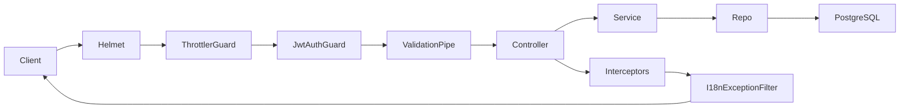

# Architecture (Sakkan backend)

High-level system map for AI agents and developers. API paths assume URI versioning **`/v1`** (see [`main.ts`](../src/main.ts)).

---

## Stack

| Layer | Technology |
| ----- | ---------- |
| Framework | NestJS 11 |
| Language | TypeScript (strict) |
| Database | PostgreSQL via Drizzle ORM |
| Cache / queues | Redis + BullMQ |
| Auth | JWT (Passport) |
| Storage | AWS S3 |
| Push | Firebase Cloud Messaging |
| SMS | Torvo |
| Payments | Paymob Accept |

---

## Request lifecycle



Global setup in [`main.ts`](../src/main.ts) and [`app.module.ts`](../src/app.module.ts):

- **Helmet** — security headers
- **ThrottlerGuard** — rate limiting (100/min default; stricter on auth routes)
- **ValidationPipe** — DTO whitelist + transform
- **TranslateInterceptor** / **ResponseTranslateInterceptor** — i18n on responses
- **I18nExceptionFilter** — translates exception keys via `Accept-Language`

---

## Module layout

```
src/
├── app.module.ts          # Root wiring
├── main.ts                # Bootstrap
├── common/                # Shared decorators, filters, interceptors, queues
├── i18n/                  # en/ + ar/ translation JSON
├── modules/               # User-facing domain modules
│   ├── auth/
│   ├── user/              # RouterModule: users/me, users/agents
│   ├── listing/
│   ├── monetization/      # BillingModule export
│   ├── db/                # Drizzle + schemas + seeds
│   └── ...
└── admin/                 # Admin panel (separate JWT strategy)
    ├── auth/
    ├── listings/
    └── users/
```

Each domain module follows **controller → service → repo**. Internal modules (`storage`, `sms`, `attachment`) have no HTTP controllers.

---

## External services

| Service | Module | Required env |
| ------- | ------ | ------------ |
| PostgreSQL | `db` | `DATABASE_URL` |
| Redis | `app.module` (BullMQ) | `REDIS_HOST`, `REDIS_PORT` |
| AWS S3 | `storage` | `AWS_*` |
| Torvo SMS | `sms` | `TORVO_SMS_API_KEY` |
| Firebase FCM | `notification` | `FIREBASE_*` |
| Paymob | `monetization` | `PAYMOB_*` |

---

## Key cross-module dependencies

- **Listing ↔ Monetization:** `ListingModule` imports `BillingModule` (forwardRef) for premium promotion on create
- **Listing ↔ City:** listing create enqueues city listing-count increment (BullMQ)
- **Listing ↔ Storage:** image upload via multer → S3 on create
- **Notification:** dispatches via BullMQ; schedulers read todos/subscriptions and enqueue jobs
- **Attachment:** orphan S3 keys cleaned via queue (triggered after user listing operations)

---

## Database

- Schemas: `src/modules/db/schemas/` — exported via [`schema-index.ts`](../src/modules/db/schemas/schema-index.ts)
- Migrations: `drizzle/` (generated; see journal at `drizzle/meta/_journal.json`)
- Seeds: `src/modules/db/seed/`, orchestrated by [`seed.ts`](../src/seed.ts)

---

## When modifying this area

1. New domain module → register in [`app.module.ts`](../src/app.module.ts)
2. New external service → add env vars to `.env.example` and [`AGENTS.md`](../AGENTS.md)
3. New global behavior → prefer `common/` (filter, interceptor, guard) over duplicating in modules
4. Cross-cutting queue → define job name in [`queue.constants.ts`](../src/common/queues/queue.constants.ts)

---

*Update this file when adding modules or external integrations.*
